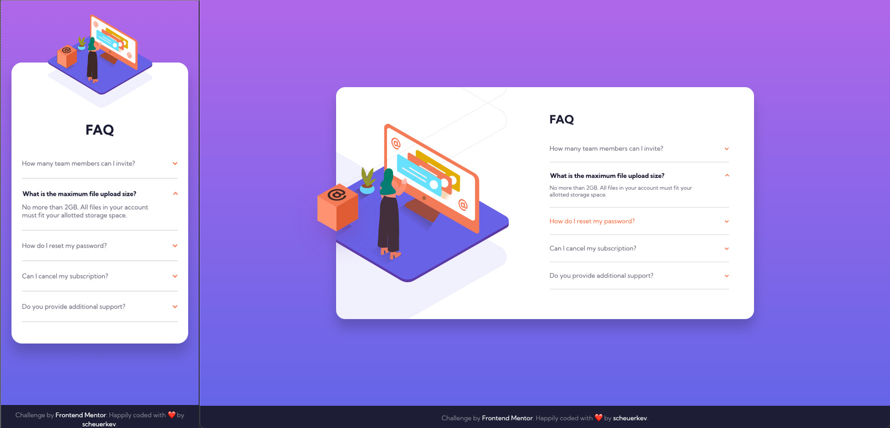

# Frontend Mentor - FAQ accordion card solution

This is a solution to the [FAQ accordion card challenge on Frontend Mentor](https://www.frontendmentor.io/challenges/faq-accordion-card-XlyjD0Oam). Frontend Mentor challenges help you improve your coding skills by building realistic projects. 

## Table of contents

- [Overview](#overview)
  - [The challenge](#the-challenge)
  - [Screenshot](#screenshot)
  - [Links](#links)
- [My process](#my-process)
  - [Built with](#built-with)
  - [What I learned](#what-i-learned)
- [Author](#author)

## Overview

### The challenge

Users should be able to:

- View the optimal layout for the component depending on their device's screen size
- See hover states for all interactive elements on the page
- Hide/Show the answer to a question when the question is clicked

### Screenshot

### Links

- Repo URL: [Code here](https://github.com/scheuerkev/faq-accordion-card-main)
- GitHub Page: [Live here](https://scheuerkev.github.io/faq-accordion-card-main/)

Please mind that production code is transpiled, minified and postfixed. If you want to have a look on originals sources code please visit it under : 
- /sass => Sass files (7-1 pattern)
- /js/index.js => Original ES6 source code

## My process

### Built with

- Semantic HTML5 markup
- CSS custom properties
- Flexbox
- CSS Grid
- Mobile-first workflow
- JS Vanilla ES6

### What I learned

I've learned a lot in difference between html image and image background component. Think it was trickier than I've presumed. As always the workflow media querries, flexbox and grid combinations show all its simplicity imo.

## Author
🦊 Kévin Scheuer
- Frontend Mentor - [@scheuerkev](https://www.frontendmentor.io/profile/scheuerkev)
- Twitter - [@scheuerkev](https://www.twitter.com/scheuerkev)

